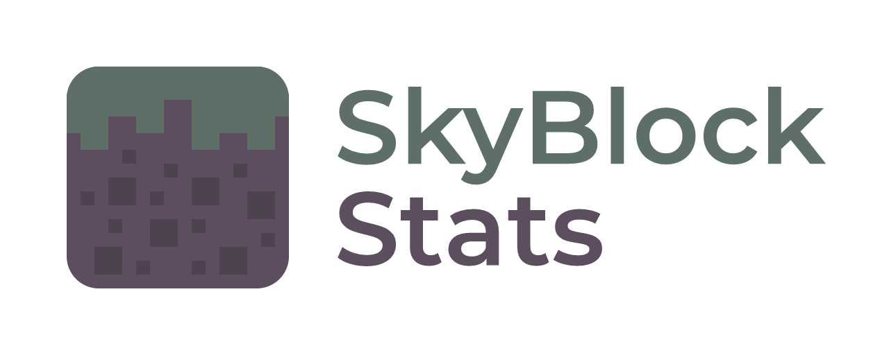
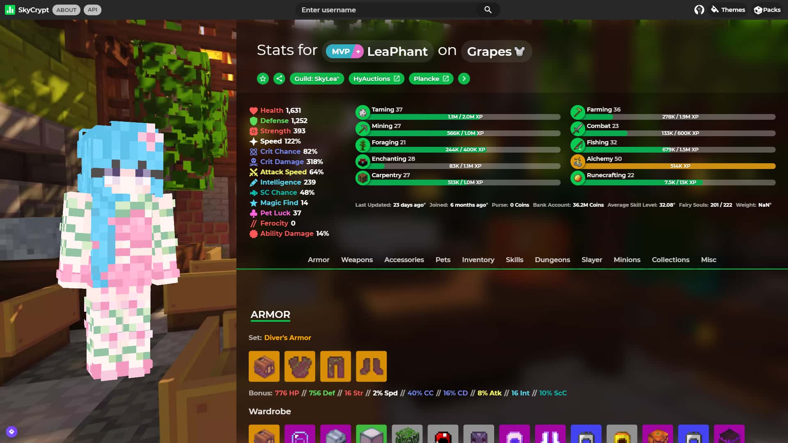

  <picture>
    <source media="(prefers-color-scheme: light)" srcset="public/resources/img/logo_black.png">
    
  </picture>

<h1 align="center">A Hypixel Skyblock Profile Viewer</h1>

The SkyCrypt Project, which is based on [LeaPhant's skyblock-stats](https://github.com/LeaPhant/skyblock-stats), allows you to share your <a href="https://hypixel.net/">Hypixel</a> SkyBlock profile with other players with a quick overview of your Stats, Skills, Armor, Weapons and Accessories.

**Website**: https://sky.shiiyu.moe

<h2 align="center">Screenshot</h1>

<h2 align="center">Contributing</h1>

You are free to report bugs or contribute to this project. Just open <a href="../../issues">Issues</a> or <a href="../../pulls">Pull Requests</a> and the Developer team will look into them.

<h3>Prerequisites</h3>

- <a href="https://nodejs.org/">Node.js</a>
- <a href="https://docs.mongodb.com/manual/administration/install-community/">MongoDB</a>
- <a href="https://redis.io/">Redis</a>
- <a href="https://api.hypixel.net/">Hypixel API Key</a>
- <a href="https://www.nginx.com/">Nginx</a> (Optional but an ideal choice for full deployment)

<h3>Installation</h3>
A more explanatory guide can be found in <a href="/CONTRIBUTING.md">CONTRIBUTING.md</a>

Clone the project and and run `pnpm i` to install the dependencies.

Now open `credentials.json` and enter a valid Hypixel API Key. You can obtain one by joining `mc.hypixel.net` and writing `/api` in chat.

`mongod` needs to be running as a service in the background and the `redis-server` needs to be started.

You can now run `pnpm start` to start it. You will be able to access the site on <a href="http://localhost:32464">http://localhost:32464</a> if you leave the default port.

<h2 align="center">Credits</h2>

- **Custom Textures**:
  - [FurfSky Reborn](https://hypixel.net/threads/4101579) by The Reborn Team
  - [RNBW+](https://hypixel.net/threads/3470904) by rainbowcraft2
  - [Hypixel Skyblock Pack](https://hypixel.net/threads/2103515) by Packs HQ
  - [Vanilla+](https://hypixel.net/threads/2147652) by TBlazeWarriorT
  - [Worlds and Beyond](https://hypixel.net/threads/3597207) by Skeletony\_
  - [Default Minecraft Textures](https://www.minecraft.net/) by Mojang
- **Player Heads**: [SkyBlock](https://hypixel.net/forums/skyblock.157/) by Hypixel.
- **Original Site**: [sky.lea.moe](https://sky.lea.moe/) by LeaPhant
